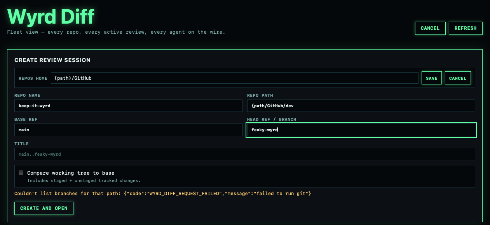
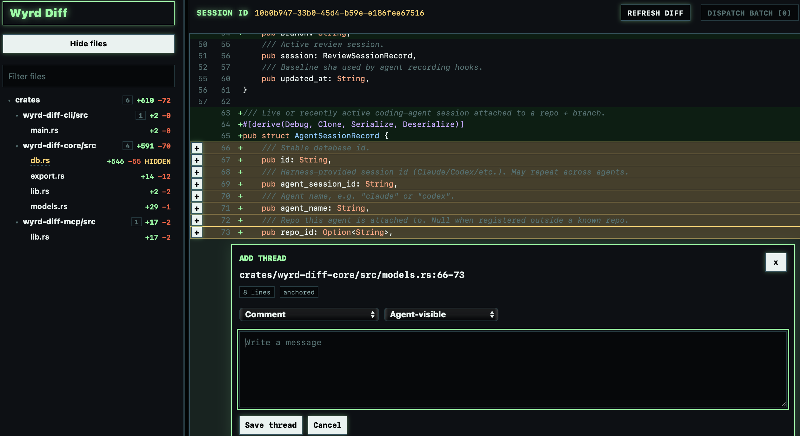

# wyrd-diff

Keep diffs wyrd

A local diff review tool that pipes your review back to the coding agent while it's still working. Comment on the diff, dispatch the batch, the agent picks it up on its next turn through MCP and applies fixes. No PR round-trip. No copy-paste into chat.

## The problem

You're running an agent on a branch. It produces 12 file changes. You want to actually review the diff before merging, not just skim what the agent claims it did.

Today, the loop sucks. You either:

- Paste diffs into chat one at a time and steer in prose ("no, change line 47 to...").
- Wait for a PR, leave GitHub comments, then ask the agent to read them back.
- Give up on review and trust the agent.

All three break the in-session feedback loop. The agent is right there with full context loaded. By the time you've copy-pasted line numbers into a chat box, that context is gone.

wyrd-diff fixes that. You review the diff in a dense, fast desktop UI. You leave line-level comments. You hit "Dispatch batch". On the agent's next turn, it queries the MCP server, sees your queued feedback, and applies it. No context loss. No PR yet. The branch stays local until you're ready.

It also keeps the byproducts. Notes, decisions, and accepted fix trajectory get persisted locally so you can export trajectory as JSONL when you want it, and ignore it when you don't.

## What you get

- A desktop review surface (Tauri + SvelteKit) for line-level comments on a diff between two refs in a local repo.
- A local Axum bridge on `127.0.0.1:8765` (falls back to 8766..8774 if taken).
- An MCP server over HTTP at `/mcp`. Wire it into Claude Code, Codex, OpenCode, Gemini, or a custom harness you define.
- Pull-based feedback delivery. The agent calls `wyrd_diff.pending_feedback`, gets queued threads with per-thread watermarks, and only sees deltas. No duplicate fixes.
- A Stop-hook recorder that links each agent commit back to the review that triggered it.
- JSONL export of accepted trajectory.

Target repo stays clean. No `.wyrd/` directory. No commits to scrub before pushing.

## Screenshots

<p>
  
  
</p>

The home view tracks active reviews across repositories and branches. The review
view keeps the file tree, highlighted diff, line selection, and thread composer
in one workspace.

## Quick start

Requires Rust 1.91+, Node 24, pnpm 10. `mise` installs the toolchain.

```bash
mise install
mise run db:migrate
mise run dev
```

`mise run dev` launches the Tauri desktop app. The app spawns the bridge itself, so no separate API process is needed.

Once it's up, the status pill in the bottom-right shows bridge health and detected agent harnesses. Click "Wire" next to Claude, Codex, OpenCode, or Gemini and the MCP server config gets written to the right file (`~/.claude.json`, `~/.codex/config.toml`, etc.) with sibling entries preserved. Restart the agent client and `wyrd-diff` shows up as an available tool.

## The loop

1. Register a local repo.
2. Start a review session against a base ref and head ref.
3. Comment on exact diff lines. Each line discussion is a thread. Threads can have follow-up replies.
4. When you have a coherent set of comments, hit "Dispatch batch". The threads are queued for delivery.
5. The agent, on its next turn, calls `wyrd_diff.pending_feedback`. It receives the queued threads as a single markdown payload with per-thread sections.
6. The agent applies fixes and commits.
7. The Stop hook records the commit and links it to the review session.
8. Mark fixes accepted or rejected. The session keeps going until the diff is what you want.

Delivery is pull, not push. Dispatching a batch makes feedback available; it does not interrupt the agent. The agent fetches on its next turn. That matters because it works the same whether the agent is local, remote, headless, or interactive.

Per-thread watermarks mean the agent never sees the same comment twice. Add a reply to a thread after the agent's first fix attempt and only the new message gets delivered next time.

## Architecture

```
┌─────────────────────┐
│  Tauri Desktop App  │  review UI, decisions, exports
│  (SvelteKit)        │
└─────────┬───────────┘
          │ spawns
          ▼
┌─────────────────────┐         ┌──────────────────┐
│  Local Axum Bridge  │ ◄─MCP── │  Agent Harness   │
│  127.0.0.1:8765     │  HTTP   │  (Claude/Codex/  │
│                     │         │   OpenCode/...)  │
└─────────┬───────────┘         └──────────────────┘
          │
          ▼
┌─────────────────────┐
│  SQLite             │  reviews, threads, notes,
│  .data/wyrd-diff.db │  decisions, fix trajectory
└─────────────────────┘
```

Crates:

- `wyrd-diff-core`: domain models, SQLite persistence, git/diff logic, export.
- `wyrd-diff-api`: Axum routes for the desktop UI and MCP HTTP transport.
- `wyrd-diff-cli`: CLI for hooks, migrations, agent wiring, standalone server.
- `wyrd-diff-mcp`: agent-facing MCP tools.
- `app/src-tauri`: Tauri shell, spawns the bridge on launch.
- `app/src`: SvelteKit UI.

Everything durable lives in `wyrd-diff-core`. The CLI, MCP, Axum, and Tauri layers are thin adapters. Swap the desktop shell for a web UI or replace MCP with another transport and the persistence layer does not move.

## Agent wiring

Three ways to wire an agent.

### From the app

The status pill detects installed harnesses and shows a "Wire" button per harness. Click it. Config gets written, sibling entries left alone.

### From the CLI

```bash
mise run configure:agents
```

### User config (`wyrd-diff.toml`)

The app reads `~/.config/wyrd-diff/wyrd-diff.toml` (honors `$XDG_CONFIG_HOME`). One file covers the repo home directory and any custom harnesses:

```toml
home_dir = "~/Documents/GitHub"

[[harness]]
id = "my-harness"
display = "My Harness"
binary = "my-harness"
path = "~/.my-harness/mcp.json"
format = "claude-json"
```

`home_dir` is where the composer scans for repos and is also writable from the app's home bar (it auto-detects `Documents/GitHub`, `github`, `code`, `src`, etc. on first launch). Legacy `harnesses.toml` in the same directory is still read when `wyrd-diff.toml` is absent.

Supported harness formats: `claude-json`, `codex-toml`, `opencode-json`, `gemini-json`. User entries override built-ins on id collision. Path expansion handles `~/`, `~`, `$HOME/`, and absolute paths.

If config writing fails (permissions, unfamiliar schema), the app falls back to a copy-pasteable snippet for the harness format.

## Session + trajectory hooks (optional but recommended)

Wyrd diff supports multiple repos, branches, and live agent sessions in parallel. To link a coding agent to the right review automatically, wire two hooks: `SessionStart` registers the agent against its `(repo, branch)`, and `Stop` records the resulting commit + response as a trajectory point. Both hooks are inert when no active review exists for the branch, so leaving them on is safe.

Pass two env vars when the hook fires:

| Var | Value |
| --- | --- |
| `WYRD_DIFF_AGENT` | `claude`, `codex`, `opencode`, `gemini`, or your own name |
| `WYRD_DIFF_AGENT_SESSION_ID` | The harness session id (`$CLAUDE_SESSION_ID`, `$CODEX_SESSION_ID`, etc.) |

The CLI infers `repo_path` from `git rev-parse --show-toplevel` and `branch` from `git rev-parse --abbrev-ref HEAD`. Override either with `WYRD_DIFF_REPO_PATH` / `WYRD_DIFF_BRANCH` if your harness runs outside the repo root.

Hook commands:

```bash
# SessionStart
cargo run --manifest-path /path/to/wyrd-diff/Cargo.toml --locked -p wyrd-diff-cli -- hook agent-start

# Stop
cargo run --manifest-path /path/to/wyrd-diff/Cargo.toml --locked -p wyrd-diff-cli -- hook agent-stop
```

Example configs:

- `examples/claude-settings.local.json`
- `examples/codex-hooks.json`

For Claude Code, put the hook in `.claude/settings.local.json`. For Codex, `.codex/hooks.json`. Both go in the target repo. Do not commit them — they contain machine-specific paths.

Once registered, agents can call `wyrd_diff.pending_feedback` with `{ agent_session_id, agent_name }` and the MCP server resolves the linked review automatically. No more hand-pasting session ids.

## Development

```bash
mise install
mise run db:migrate
mise run dev          # Tauri desktop + bridge
mise run dev:ui       # SvelteKit only
mise run dev:api      # Axum bridge only
mise run dev:mcp      # MCP over stdio (for debugging)
mise run check        # fmt + lint + typecheck + tests
```

Targeted Rust tests:

```bash
cargo test --locked -p wyrd-diff-core
```

Reset local DB if a migration goes sideways:

```bash
mise run db:reset
```

See `AGENTS.md` for ownership boundaries and contributor conventions.

## Status

Pre-1.0. APIs and schema can change. Migrations are forward-only with no automatic rollback. If you depend on the JSONL export shape, pin a commit.

## License

MIT.
